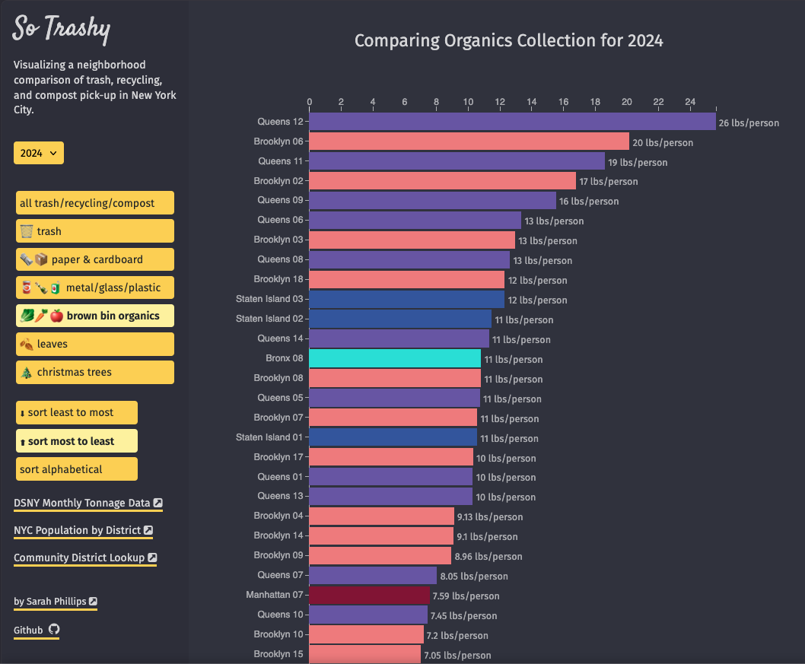
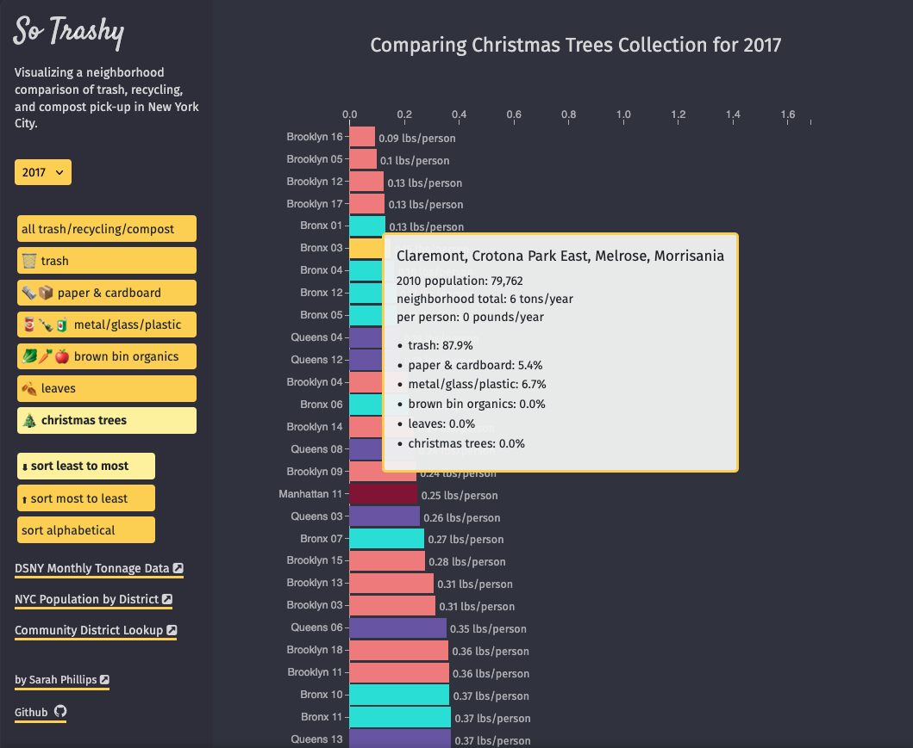
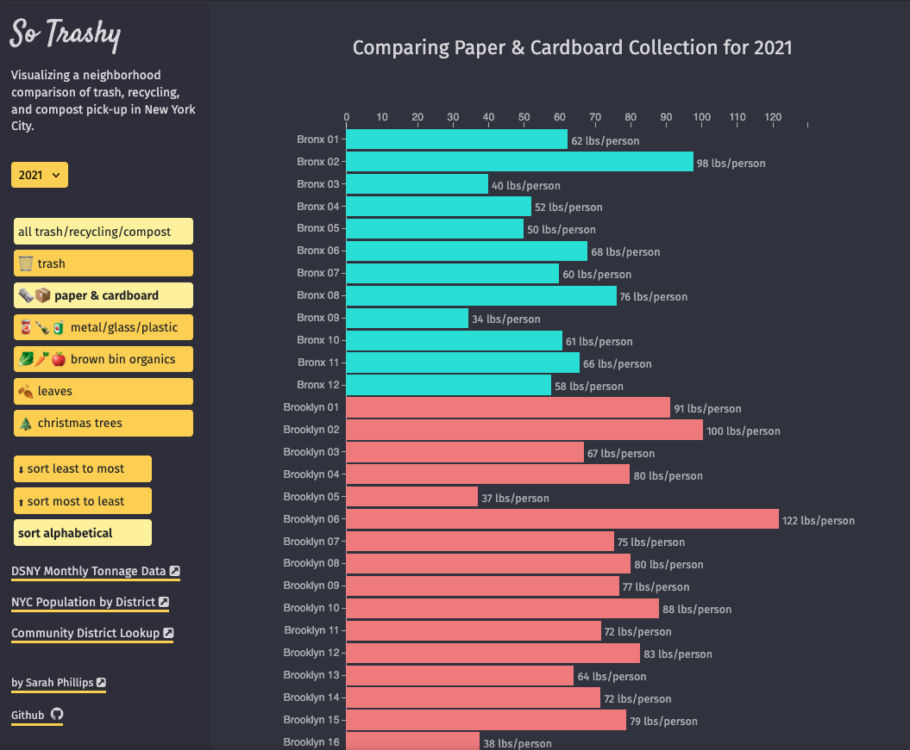

# So Trashy

## Project Description

So Trashy is a data visualization that compares New York City's Department of Sanitation's (DSNY) monthly collection of refuse and recycling across New York City community districts/neighborhoods. So Trashy displays the latest information provided by DSNY via open data APIs.

View site here: https://so-trashy.netlify.app/




## Site Features
 
- Horizontal bar chart representing all refuse picked up by DSNY, displayed by community district/neighborhood
- Buttons to switch between refuse types: trash, paper, metal/plastic/glass, organics, leaves & Christmas trees
- Dropdown menu to view refuse generation by year (2010–present)
- Radio buttons to sort the data ascending, descending, or alphabetically
- Per-person calculations (pounds/person/year), using U.S. Census population data by community district
- Interactive tooltips on hover (desktop) or tap (mobile), showing a breakdown of collection by category
- Keyboard-accessible chart: bars can be focused and activated with Tab, Enter/Space, and dismissed with Escape
## Tech Stack
 
- React
- TypeScript
- D3.js (v5)
- Vite
- Lodash
## Project Structure
 
```
src/
├── components/     # React UI components (Sidebar, BarChart, ChartHeader, etc.)
├── data/           # Static datasets (population by district, known data-gap notes)
├── types/          # Shared TypeScript types
└── utilities/      # Data transformation, chart drawing, and tooltip logic
```
 
## Data Sources
 
- [DSNY Monthly Tonnage Data](https://data.cityofnewyork.us/City-Government/DSNY-Monthly-Tonnage-Data/ebb7-mvp5) (nyc.gov Open Data API)
- [New York City Population By Community Districts](https://data.cityofnewyork.us/City-Government/New-York-City-Population-By-Community-Districts/xi7c-iiu2) (nyc.gov Open Data API)
## Known Data Limitations
 
The city's raw data has some gaps and quirks that affect what's shown in the chart:
 
- **Leaves and organics collection weren't measured/widely collected in earlier years.** If a bar shows 0 (or is disabled) for "leaves" or "brown bin organics" in certain years, that's expected — not a bug. See `src/data/refuseDataNotes.ts` for the full list of years/refuse types affected, and `src/utilities/getRefuseDataNote.ts` for how this is surfaced in the UI.
- **Queens Community District "7A"** appears in the DSNY tonnage dataset starting in 2020 but has no corresponding entry in the population dataset. Entries for 7A are currently skipped rather than charted, since there's no population figure to calculate pounds/person.
- Population figures are only available for 2010 and 2020 (Census years). The app uses the 2010 figure for years before 2020, and the 2020 figure for 2020 and later — it does not interpolate between them.
- Source data is reported monthly; the app sums all 12 months to produce the yearly totals shown in the chart.
## Accessibility
 
- Bars have `role="img"` and descriptive `aria-label`s (community district name, refuse type, and pounds/person/year).
- Bars are keyboard-focusable and can be activated with Enter or Space; Escape dismisses the tooltip.
- On mobile, tapping a bar opens a bottom "info shelf" panel instead of a hover tooltip, with a close button.
## How to Run Locally
 
1. Clone this repo
2. Install dependencies:
```
   npm install
```
3. Start the dev server:
```
   npm start
```
4. Open your browser to the address Vite provides — typically http://localhost:5173/
> **Note:** This app fetches live data from NYC Open Data on load, so you'll need an internet connection while running it locally.
 
## How to Update NPM Packages
 
This app has many dependencies, so this guide will come in handy when they need updating:
https://bytearcher.com/articles/using-npm-update-and-npm-outdated-to-update-dependencies/
 
- Ask npm to list which packages have newer versions available:
```
  npm outdated
```
- Ask npm to install the latest version of a package, using the `@latest` tag and `--save` flag to update `package.json`. For instance, to update lodash:
```
  npm install lodash@latest --save
```
- Check the app between every update by stopping and restarting the server. If the app is still working, move on to the next dependency.
